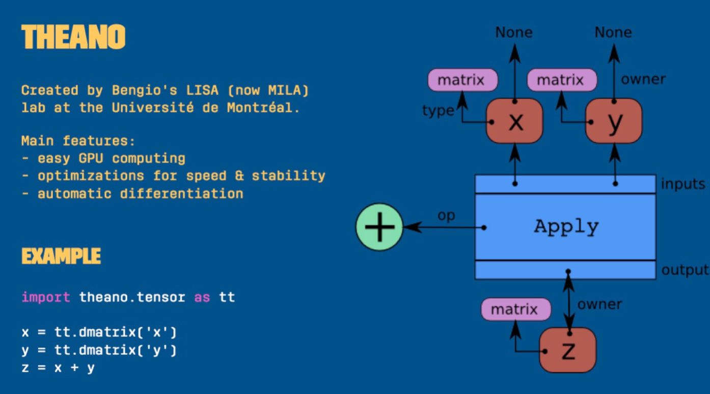
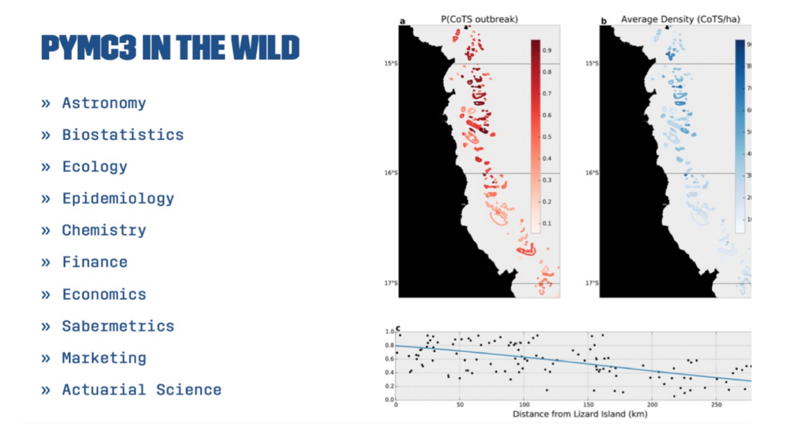
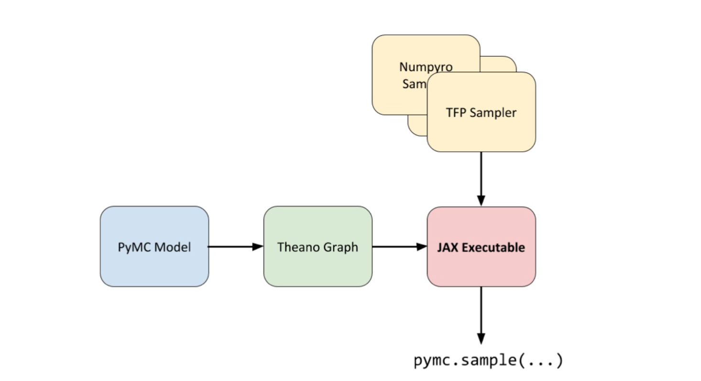
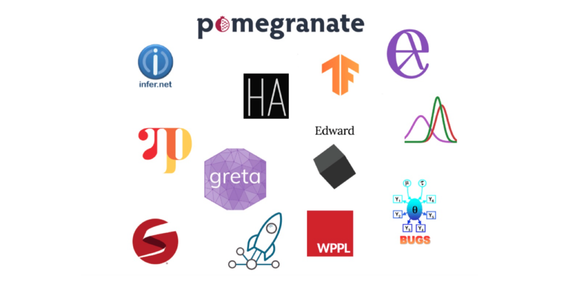
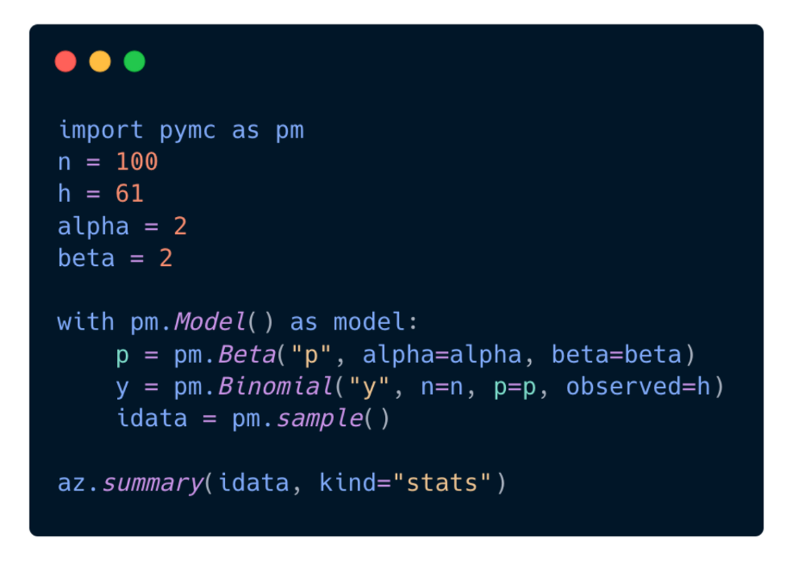

(PyMC_past_present_future)=
# PyMC: Past, Present, and Future

:::{post} January 25, 2023
:tags: events, community, talks
:category: news, testimonial
:author: Sangam SwadiK, Rowan Schaefer
:image: 0
:exclude:

Summary of Chris Fonnesbeck's PyMCon 2020 keynote.
:::

At the [2020 PyMCon conference](https://pymc-devs.github.io/pymcon/about), Chris Fonnesbeck discussed the history and future of PyMC in his talk ["PyMC: Past, Present, and Future"](https://youtu.be/RXODDVK7B-g).
 
<iframe width="560" height="315" src="https://www.youtube.com/embed/RXODDVK7B-g" title="YouTube video player" frameborder="0" allow="accelerometer; autoplay; clipboard-write; encrypted-media; gyroscope; picture-in-picture; web-share" allowfullscreen>
</iframe>
 
In the talk, he discussed the broader context of probabilistic programming in the early 2000s, outlined the challenges and successes of early development, and provided insights into the future direction of the project. 

## Background

### What is PyMC?

[PyMC](https://www.pymc.io/welcome.html) is a powerful and widely used probabilistic programming framework that allows users to implement state-of-the-art Bayesian inference methods in Python. The project was started by Chris Fonnesbeck in 2003 as a graduate student at the University of Georgia, and has since grown to almost 400 contributors.

### What is a probabilistic programming language?

A probabilistic programming language is a language that employs [stochastic](https://en.wikipedia.org/wiki/Stochastic) [primitives](https://en.wikipedia.org/wiki/Primitive_data_type). Just as we have integers and strings and floating point numbers in most languages, a probabilistic programming language will have **random variables** or **probability distributions.**

Why? These stochastic primitives are used as building blocks to build Bayesian models. They give us the ability to specify probability models at a very high level. 

By abstracting away much of the underlying machinery that goes into random number sampling and other forms of inference, probabilistic programming makes Bayesian inference more accessible to those who are not software developers or statisticians.

## Development Timeline

### Early 2000s

In the year 2000, Chris Fonnesbeck was a graduate student at the University of Georgia studying biology. With statistical experience in SAS, he started experimenting with Bayesian models using WinBUGS and OpenBUGS.

[WinBUGS](https://www.mrc-bsu.cam.ac.uk/software/bugs/the-bugs-project-winbugs/), released in 1997, was the first software to provide an alternative to manually coding samplers for Bayesian models. However, it had a number of limitations: it was only supported on Windows without a virtual machine, it was closed source, and it could be phenomenally hard to debug.

The project eventually became open-source via [OpenBUGS](https://www.mrc-bsu.cam.ac.uk/software/bugs/openbugs/), but per its developer Andrew Thomas, it was “open source only in a read-only sense”. In addition, it was coded in [Component Pascal](https://en.wikipedia.org/wiki/Component_Pascal), required a proprietary windows-only IDE (integrated development environment) to build, and the source code was not in plain text. 

Despite these challenges, WinBUGS and OpenBUGS provided invaluable experience in Bayesian modeling for beginners, and paved the way for the development of PyMC as well as other tools that made it easier to implement Bayesian inference methods.

### 2003-2005

In 2003, Chris Fonnesbeck began writing the first version of PyMC, with the goal of being able to build Bayesian models in Python. 

The first version was an object-oriented implementation of Markov chain Monte Carlo (MCMC), based on the numeric package, and heavily influenced by Chris’s prior experiences with Java.

PyMC 1.0 was released in 2005, and it was used by a small group of regular users associated with the University of Georgia. It ended up on [SourceForge](https://sourceforge.net/projects/pymc/), where others in the community began contributing. This led to biologists Anand Patil and David Heward joining the project in 2006.

### 2006–2013

In 2006, Anand Patil and David Heward began expanding and refactoring a lot of the code for PyMC 2.0, which became a comprehensive probabilistic programming library that included a wide range of statistical distributions. 

Version 2.0 was based on a set of Fortran functions that were compiled into Python using {ref}`F2PY <numpy:f2py>`, which allowed for improved performance. It also made use of the NumPy library, provided support for Python 3, implemented Gaussian processes, and provided convergence diagnostics.  After its release in October 2013, it attracted the interest of applied users in fields such as ecology and astronomy.

### 2011-2015

The Metropolis-Hastings and Gibbs samplers, two algorithms used to draw samples from an unnormalized probability model, performed slowly for large or complex models.  

The next generation of Bayesian inference methods aimed to solve these problems — namely, a gradient-based MCMC or hybrid Monte Carlo. 

The No-U-Turn-Sampler (NUTS algorithm), [developed by Matt Hoffman and Andrew Gelman in 2011](https://arxiv.org/abs/1111.4246), used information about the gradient of the log posterior-density to identify regions of higher probability to help it converge quickly on large problems. This was much faster than traditional sampling methods.

John Salvatier developed the mcex package to experiment with gradient-based MCMC samples, and the following year he was invited by the team to re-engineer PyMC. Rather than relying on Fortran, he did this using the Theano package — a deep learning library initially developed for implementing neural network models.

The use of Theano allowed for constructing and compiling a graph to C. This enabled optimization, use on GPUs, and automatic differentiation. 

Later on several other methods were added to PyMC, such as variational inference methods, largely thanks to the efforts of Taku Yoshioka and Max Kochurov.

There was a significant increase in the number of users of PyMC 3.0 compared to Version 2 and widely used in many applications.

Some examples of notable users include Aaron McNeil, a marine biologist who used PyMC to model the spread of crown of thorns starfish on the Great Barrier Reef, and Kevin Systrom and Thomas Vladick, the founder of Instagram and a developer, respectively, who used PyMC to model the basic reproductive number (Rt) of COVID-19 in different states in the US. This allowed them to provide real-time information about the spread of the virus.

### 2016

In 2016, [PyMC became a sponsored project under NumFOCUS](https://numfocus.org/uncategorized/numfocus-announces-new-fiscally-sponsored-project-pymc3), a nonprofit organization that provides sustainability and support to open-source projects. By joining NumFOCUS, PyMC was able to access educational programs and events, as well as additional resources, to help ensure its continued development and success. 

This support has been instrumental in allowing PyMC to continue to grow and thrive in the open source space, as well as in expanding community and diversity efforts.

### 2017-2020

In October 2017, the Mila team at the University of Montreal responsible for the Theano framework, used by PyMC as its computational backend, decided to discontinue the project due to the availability of other well-supported frameworks. 

This presented a challenge for PyMC, which relied heavily on Theano. The PyMC team spent over a year evaluating other computational backends, including MXNet, TensorFlow, and PyTorch, before deciding to try TensorFlow.  TensorFlow had been supportive of PyMC and was developing TensorFlow Probability, which included components that would be useful for PyMC. However, the rapid changes to TensorFlow presented many challenges.

In 2020, while working on the symbolic PyMC project, Brandon Willard had the idea to link Theano to [JAX](https://jax.readthedocs.io/en/latest/notebooks/quickstart.html) as a computational back end. This would allow Theano to take advantage of JAX's autograd and linear algebra acceleration capabilities without the constraints of a deep learning framework. Willard successfully developed a JAX linker for Theano and used it to create the Theano-PyMC library (later renamed to Aesara), to be used as a back-end for PyMC.

The first [PyMCon](https://pymc-devs.github.io/pymcon/speakers) took place in October 2020. Chris Fonnesbeck closes out the talk by thanking everyone who worked to make the conference a reality, including Executive Directors Thomas Wiecki and Ravin Kumar. You can view the presentations here, or view the full talks on [the PyMCon playlist on YouTube](https://www.youtube.com/watch?v=UznM_-_760Y&list=PLD1x-BW9UdeHN2vwR6kIApJATd2jZzeya).

## 2020

How far have we come from the early 2000s?

As Chris Fonnesbeck says, we are currently in the “golden age of probabilistic programming” — there are  now many options to implement Bayesian models on different platforms.

Today, when you build a model in PyMC, the interface is designed to be intuitive and easy to use. PyMC aims to make it as easy to code your model as it is to write it down on a whiteboard:

You can simply run the {func}`pymc.sample` function to fit your model, which automates many of the decisions involved in the process. This allows you to generate MCMC results with just one line of code, without having to worry about the technical details of the algorithm. Thomas Wiecki, one of the founding developers, refers to this as the "automatic inference button".
Chris's presentation was in October 2020.  Below find updates to the PyMC library since that keynote. 

## 2022 (June)

[PyMC v4.0 was released](https://www.pymc.io/blog/v4_announcement.html) in June 2020, which incorporated these major changes:  
- PyMC3 was renamed PyMC
- PyMC backend now used Theano; this new backend was renamed Aesara
- JAX backend for faster sampling
- Dynamic shape support
- New website design:  [www.pymc.io/](https://www.pymc.io/.)

## 2023 (November)
PyMC v5.0 was released: [PyMC forked Aesara to PyTensor](https://www.pymc.io/blog.html)

## What’s Next?

Want to get started with Bayesian analysis? 

There’s never a better time than now to begin contributing to PyMC! Check the {ref}`PyMC Devs calendar <calendar>` or [PyMC Meetup group](https://www.meetup.com/pymc-online-meetup/events/) and watch for our office hours, or get started with our [contributing page.](https://www.pymc.io/projects/docs/en/latest/contributing/index.html)

Or, join us on the [PyMC Discourse](https://discourse.pymc.io/) and connect with the Bayesian community! 

## Learn More

PyMC in action! 💥 Check out the following pages in our [example gallery](https://www.pymc.io/projects/examples/en/latest/gallery.html):

- [PyMC: Core Notebooks](https://www.pymc.io/projects/examples/en/latest/gallery.html#core-notebooks)
- [PyMC Case studies](https://www.pymc.io/projects/examples/en/latest/gallery.html#case-studies)
- [Gaussian Processes](https://www.pymc.io/projects/examples/en/latest/gallery.html#gaussian-processes)
- [Variationa Inferencel](https://www.pymc.io/projects/examples/en/latest/gallery.html#variational-inference)
- [Causal Inference](https://www.pymc.io/projects/examples/en/latest/gallery.html#causal-inference)

## Connect with PyMC

Connect with PyMC via:
- Website:  [pymc.io](https://www.pymc.io)
- Discourse: [discourse.pymc.io](https://discourse.pymc.io)
- YouTube: [PyMCDevelopers](https://www.youtube.com/c/PyMCDevelopers)
- Star GH repo:  [pymc-devs/pymc](https://github.com/pymc-devs/pymc)
- Join Meetup: [pymc-online-meetup](https://www.meetup.com/pymc-online-meetup/)
- Twitter: [@pymc_devs](https://twitter.com/pymc_devs)
- LinkedIn: [@pymc](https://www.linkedin.com/company/pymc/)
